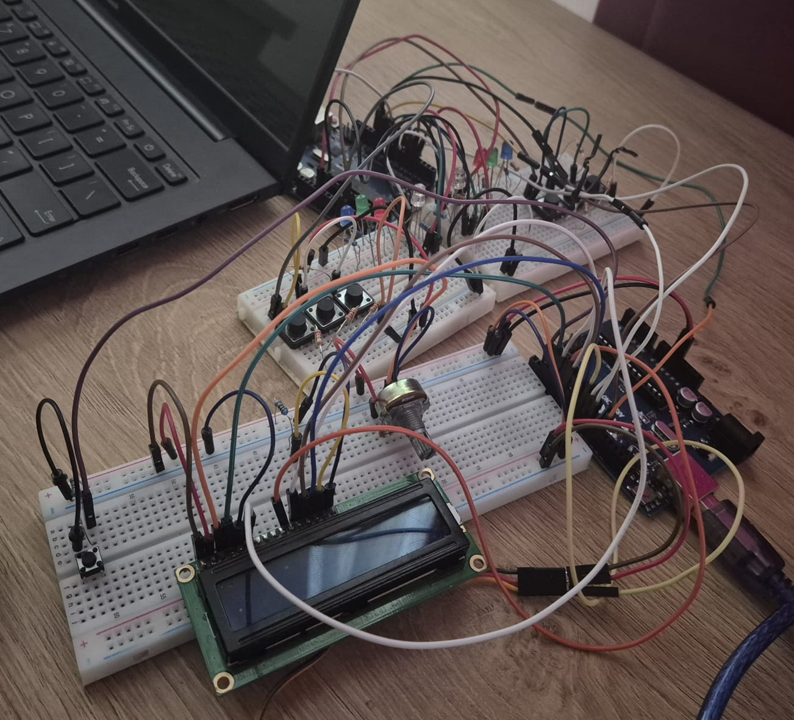
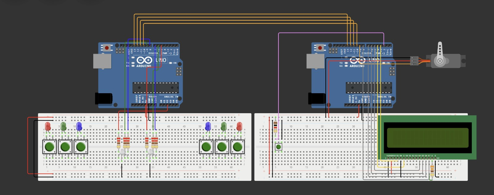

# Quick_Time

## Table of contents
- [Overview](#overview)
- [Hardware Setup](#hardware-setup)

## Overview
In this project, each team will create a competitive reflex game for two players, where both participants will compete to achieve the highest score by testing their reaction speed. The project will be carried out in teams of two people.

Each player will have their own buttons and LEDs, and the game will take place over several rounds. The goal of each player is to press the button corresponding to the color displayed on their team's RGB LED as quickly as possible. Each player's score will be displayed on an LCD screen and updated throughout the game. At the end of the game, the player with the highest score is declared the winner.

## Hardware Setup
### Components
- x2 Arduino UNO board (ATmega328P microcontroller)
- x2 RGB LED 
- x7 push buttons 
- x13 220Ω resistors
- x2 5K1 resistors
- x4 Breadboard
- servomotor
- LCD
- pontentiometer
- Jumper wires

### Project schematic

## Live circuit

## Final result
https://youtu.be/QipS0Jelmyw
